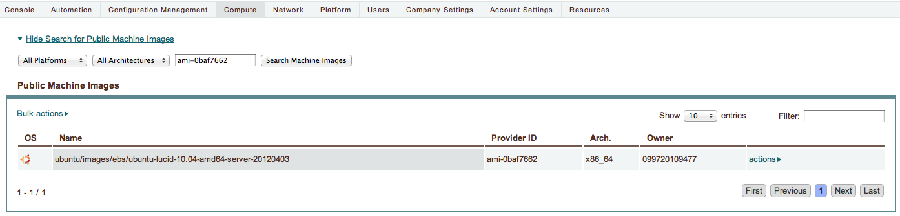
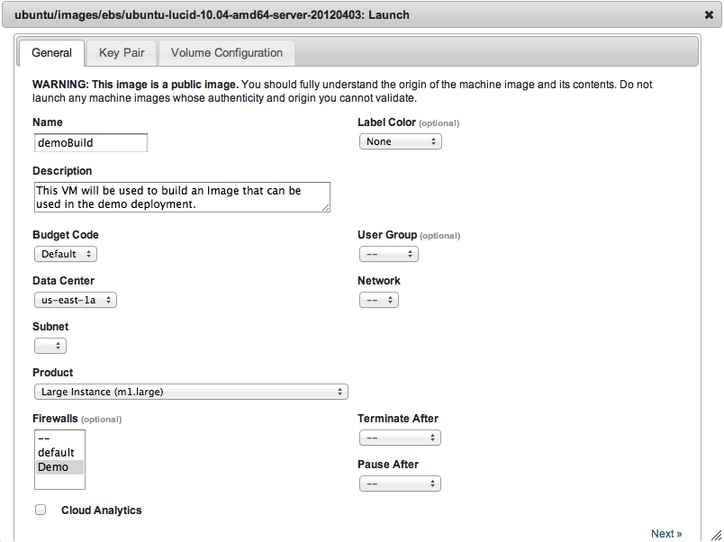
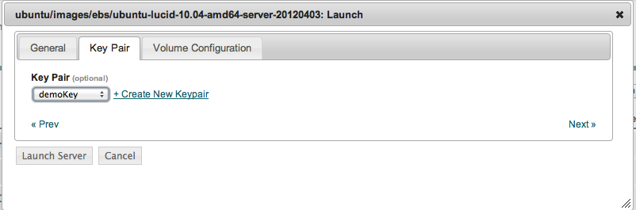
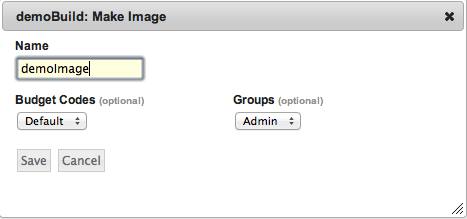

Make Image
----------

To make an image, start with a generic EC2 image from `Alestic <http://alestic.com/>`_.
Eric's team has recently begun publishing only 64-bit images. Any generic ubuntu image
*should* work, but this tutorial has only been tested with images from Alestic.

   Search for AMI

1. Start the image as a VM, choose a large product size, not t1.micro for best results.
   Also, generate and use an SSH key during the launch.

   Launch, General Information

Save the key and chmod it

.. code-block:: bash

   chmod 600 demoKey

   Launch, Create/Use Key

2. While the image launches, open the firewall so you can access port 22 from your
   location.
3. Once the VM is started, copy the wordpress-demo-prep.tar.gz file to the instance.
   The command to do so will be something of the form:

.. code-block:: bash

   scp -i demoKey wordpress-demo-prep.tar.gz ubuntu@ip.of.running.instance:~

4. Next, ssh onto the running instance, and take root:

.. code-block:: bash

   ssh -i theKey ubuntu@ip.of.running.instance

   sudo su

5. Install the chef client and execute the chef-solo run:

.. note:: When prompted for the Chef Server URL, just hit enter. 
   This tutorial does not rely on a chef-server.

.. code-block:: bash

   echo "deb http://apt.opscode.com/ `lsb_release -cs`-0.10 main" | sudo tee /etc/apt/sources.list.d/opscode.list
   sudo mkdir -p /etc/apt/trusted.gpg.d
   gpg --keyserver keys.gnupg.net --recv-keys 83EF826A
   gpg --export packages@opscode.com | sudo tee /etc/apt/trusted.gpg.d/opscode-keyring.gpg > /dev/null
   sudo apt-get update
   sudo apt-get -y upgrade
   sudo apt-get -y install chef

   tar -zxf wordpress-demo-prep.tar.gz > /dev/null 2>&1
   chef-solo -j node.json -c solo.rb 

.. note:: For reference, when running this on a m1.large VM in th us-west-2 (Oregon)
  region, the above script took 3 minutes and 9 seconds.

During this step, some packages necessary for running a typical LAMP stack application
will be installed, along with the latest enStratus agent. Depending on your connection and
mirror speeds, this may take up to 5-7 minutes.

The purpose of this step is to prepare the image for running PHP and MySQL applications,
not to install the application itself, that comes later durin the launch and orchestration
steps of a deployment launch.

Once this step completes, initiate the build of the machine image from within the
enStratus console.

.. warning:: If the image is not built using the server actions > Make Image menu option
  in the enStratus console, it will not be available for use in the deployment. This measure
  is in place to protect users from attempting to use an image that does not have the agent
  on it for automation.

.. note:: As a sanity check that the agent is working, you should see an expanded list of
  options in the actions menu as shown.

.. figure:: ./images/makeImage1.png
   :height: 700px
   :width: 2500 px
   :scale: 35 %
   :alt: Server, Make Image
   :align: center

   Server, Make Image

Once this process completes, select action > Make Image from the server's action menu.

   Make Image

While the image builds, it's time to upload the service images for use by enStratus.
