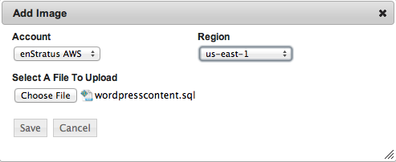
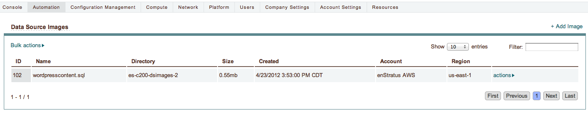

Upload DataSource
-----------------

Using Automation > Datasource, upload wordpresscontent.tar.gz as datasource files.
enStratus stores datasource files in cloud files storage and will initiate a download of
this file to services that are configured to have datasources.

   Data Source, Upload

After upload, the datasource will appear as shown:

   Data Source, Upload
