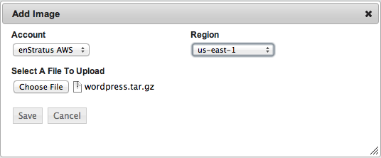
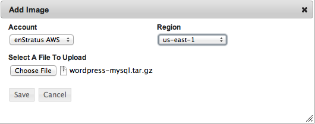
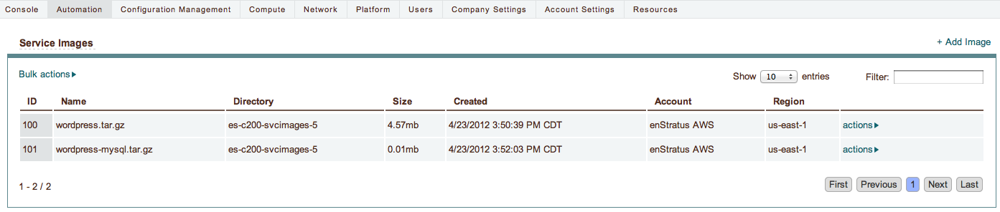

Upload Services
---------------

Using Automation > Service Images, upload wordpress.tar.gz and mysql.tar.gz as service
image files. enStratus stores these files in cloud files storage and will initiate a
download of these files at launch time by the enStratus agent.

   Service Upload, Wordpress

Repeat this action for the mysql service.

   Service Upload, MySQL

Once this action is complete, there will be (minimally) 2 services.

   Services Uploaded
